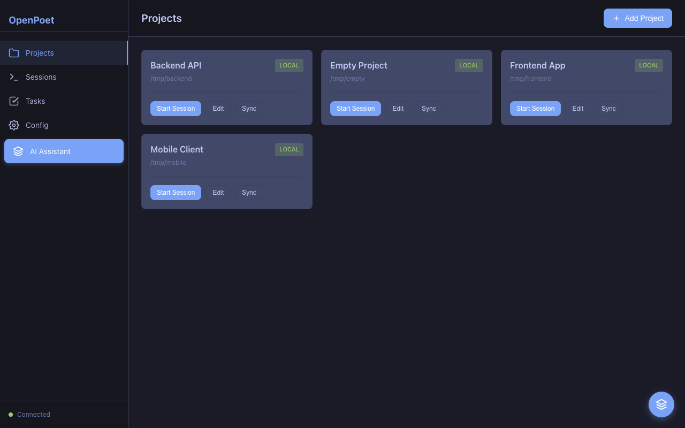

<p align="center">
  <a href="https://openpoet.ai" target="_blank">
    
  </a>
</p>

<h1 align="center">OpenPoet</h1>

<p align="center">
  Orchestrate Claude Code sessions across multiple projects from a single web interface.
</p>

<p align="center">
  <a href="LICENSE"></a>
  <a href="https://go.dev/"></a>
  <a href="https://github.com/openpoet/openpoet/releases"></a>
  <a href="https://goreportcard.com/report/github.com/openpoet/openpoet"></a>
</p>

<p align="center">
  <a href="https://openpoet.ai"><strong>openpoet.ai</strong></a> · <a href="https://openpoet.ai/docs.html"><strong>Documentation</strong></a>
</p>

## What is OpenPoet?

OpenPoet is an open-source web application that lets you orchestrate multiple [Claude Code](https://docs.anthropic.com/en/docs/claude-code) sessions from a single dashboard. It provides project management, task tracking, a skills system for reusable prompts, and MCP server integration — all accessible from desktop or mobile via a PWA-enabled interface. Whether you're managing one project or a dozen, OpenPoet gives you a centralized control plane for AI-assisted development.

<p align="center">
  
</p>

## Install

### Homebrew (macOS and Linux)

```bash
brew install openpoet/tap/openpoet
```

### Shell script (macOS and Linux)

```bash
curl -fsSL https://raw.githubusercontent.com/openpoet/openpoet/main/install.sh | sh
```

Installs to `~/.local/bin` by default (no sudo required). The installer will offer to add it to your PATH if needed.

Install a specific version:

```bash
curl -fsSL https://raw.githubusercontent.com/openpoet/openpoet/main/install.sh | OPENPOET_VERSION=1.0.0 sh
```

Install to a custom directory:

```bash
curl -fsSL https://raw.githubusercontent.com/openpoet/openpoet/main/install.sh | OPENPOET_INSTALL=/custom/path sh
```

Uninstall:

```bash
curl -fsSL https://raw.githubusercontent.com/openpoet/openpoet/main/install.sh | sh -s -- --uninstall
```

### PowerShell (Windows)

```powershell
irm https://raw.githubusercontent.com/openpoet/openpoet/main/install.ps1 | iex
```

Installs to `~\.local\bin` by default (no Administrator required). The installer will offer to add it to your PATH.

Install a specific version:

```powershell
$env:OPENPOET_VERSION = "1.0.0"; irm https://raw.githubusercontent.com/openpoet/openpoet/main/install.ps1 | iex
```

Install to a custom directory:

```powershell
$env:OPENPOET_INSTALL = "C:\custom\path"; irm https://raw.githubusercontent.com/openpoet/openpoet/main/install.ps1 | iex
```

Uninstall:

```powershell
& ([scriptblock]::Create((irm https://raw.githubusercontent.com/openpoet/openpoet/main/install.ps1))) --uninstall
```

### Manual download

Download the binary for your platform from the [Releases page](https://github.com/openpoet/openpoet/releases).

| Platform | Architecture | Archive |
|---|---|---|
| macOS | Apple Silicon (M1+) | `openpoet_VERSION_darwin_arm64.tar.gz` |
| macOS | Intel | `openpoet_VERSION_darwin_amd64.tar.gz` |
| Linux | x86_64 | `openpoet_VERSION_linux_amd64.tar.gz` |
| Linux | ARM64 | `openpoet_VERSION_linux_arm64.tar.gz` |
| Windows | x86_64 | `openpoet_VERSION_windows_amd64.zip` |
| Windows | ARM64 | `openpoet_VERSION_windows_arm64.zip` |

## Quick Start

```bash
openpoet
# Open http://localhost:8080 in your browser
```

### CLI Options

```
openpoet [flags]
openpoet version       Print version
openpoet mcp-serve     Run as MCP server
openpoet benchmark     Run benchmarks
```

| Flag | Default | Description |
|---|---|---|
| `-port` | `8080` | Port to listen on |
| `-bind` | `0.0.0.0` | Address to bind to |
| `-db` | `openpoet.db` | SQLite database path |
| `-openai-key` | | OpenAI API key for voice transcription |
| `-mcp-http` | `false` | Enable MCP HTTP endpoint at /mcp |


### Windows Support

OpenPoet runs natively on Windows. Backend availability depends on whether WSL is installed:

| Backend | WSL Required? | Notes |
|---|---|---|
| **ACP (Copilot)** | No | Runs entirely as a native Windows process (`openpoet.exe acp-agent` + `copilot.exe --acp`). |
| **Copilot (direct)** | No | Works natively if `copilot.exe` is in your PATH. |
| **Claude Code** | Yes | Claude Code is a Node.js CLI that requires a Unix environment. OpenPoet automatically wraps it through `wsl.exe` using Windows ConPTY. |

**To use Claude Code sessions on Windows:**

1. Install [WSL 2](https://learn.microsoft.com/en-us/windows/wsl/install) (`wsl --install` in PowerShell)
2. Install Claude Code inside WSL: `npm install -g @anthropic-ai/claude-code`
3. Start OpenPoet normally on Windows — sessions targeting Claude Code will automatically run through WSL

Windows 10 version 1809 or later is required (ConPTY support).

## Features

- [**Multi-Project Management**](https://openpoet.ai/docs/projects.html) — Manage both local and remote (SSH) projects
- [**Claude Code Integration**](https://openpoet.ai/docs/sessions.html) — Start and manage AI-assisted terminal sessions
- [**Skills System**](https://openpoet.ai/docs/skills.html) — Create and sync instruction templates for Claude Code
- [**MCP Server Configuration**](https://openpoet.ai/docs/mcp-servers.html) — Configure and inject MCP servers into sessions
- [**Task Management**](https://openpoet.ai/docs/tasks.html) — Track todos, progress, and priorities per project
- [**Mobile-Optimized UI**](https://openpoet.ai/docs/mobile.html) — Full-featured mobile terminal with voice input
- [**PWA Support**](https://openpoet.ai/docs/mobile.html) — Install as a progressive web app with offline capability

## Development

```bash
# Build
make build

# Run in development mode
make dev

# Run tests
make test
```

## Contributing

Contributions are welcome! Please see [CONTRIBUTING.md](CONTRIBUTING.md) for guidelines on how to get started.

## Community

- [GitHub Discussions](https://github.com/openpoet/openpoet/discussions) — Ask questions and share ideas
- [Issue Tracker](https://github.com/openpoet/openpoet/issues) — Report bugs and request features

## Acknowledgments

- [Claude Code](https://docs.anthropic.com/en/docs/claude-code) by Anthropic
- [xterm.js](https://xtermjs.org/) for terminal emulation
- [Chi](https://github.com/go-chi/chi) for HTTP routing

## License

[MIT](LICENSE)
